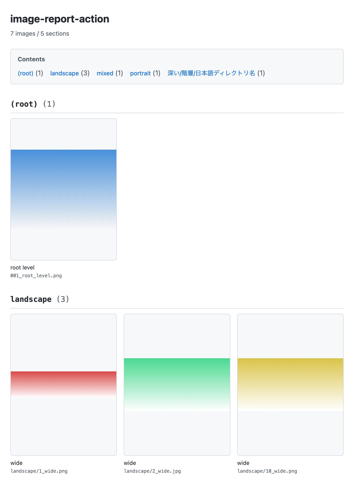

# image-report-action

A GitHub Action that recursively collects images under a given directory, generates a **single HTML report with base64-embedded images**, uploads it as an Artifact, and comments on the PR.

Review CI screenshots **right in the browser — no download, no unzip**.

## What the report looks like

<a href="docs/screenshot.png"></a>

A real report generated from [`test/fixtures/images`](test/fixtures/images) — click the thumbnail to enlarge, or open the source file at [`docs/example-report.html`](docs/example-report.html). The images are gradient placeholders, so the point is the layout, not the pictures: a table of contents, one section per directory, `(root)` for images directly under the scanned path, and natural sort (`1_wide` < `2_wide` < `10_wide`).

The screenshot is cropped to the first two sections; the remaining three — including a non-ASCII one (`深い/階層/日本語ディレクトリ名`) — are in the HTML.

GitHub renders `.html` as source rather than as a page, so to see the real thing — including the lightbox — clone the repo and open the file in a browser.

## Why

Neither the `gh` CLI nor the GitHub API can attach images to a PR body. Until now, CI screenshots could only be published as zipped Artifacts, and reviewers had to download, unzip, and open them one by one — so in practice, nobody looked at them.

With `archive: false` in `actions/upload-artifact@v7` (single-file upload without zipping), **a single HTML file renders inline in the browser as soon as you open the Artifact URL**. Access control comes for free: GitHub login plus repository read permission.

## Usage

```yaml
name: test

on: pull_request

permissions:
  contents: read
  pull-requests: write # required for PR comments (see below)

jobs:
  test:
    runs-on: ubuntu-latest
    steps:
      - uses: actions/checkout@v6

      - name: Run tests
        run: npm test # assume screenshots land in tmp/screenshots

      - name: Image report
        if: always() # a failing test is exactly when you want the screenshots
        uses: aki77/image-report-action@v1
        with:
          path: tmp/screenshots
```

That's all it takes to get a comment like this on your PR:

> ### my-repo
>
> [📄 Open report](...)
>
> 42 images / commit `a1b2c3d`

When you push again to the same PR, the comment is **updated rather than duplicated**.

### Why `permissions` is required

A composite action cannot declare its own `permissions:`. To comment on a PR, **the calling workflow must grant `pull-requests: write`**.

If you don't need the comment, set `comment: 'false'`. In that case `pull-requests: write` is unnecessary.

### Using `if: always()`

A failing test is exactly when you want to see the screenshots, so adding `if: always()` to the report step is recommended. Even if the tests bail out before the screenshot directory is ever created, the action just **warns about zero images and the job still succeeds** — report generation never turns a job red.

## inputs

| Name | Required | Default | Description |
|---|---|---|---|
| `path` | ✅ | — | Root directory to scan, searched recursively |
| `title` | | Repository name | Report heading |
| `report-name` | | `image-report.html` | Report file name. **This becomes the Artifact name verbatim** |
| `normalize-captions` | | `true` | Strip leading sequence numbers from captions and turn `_` into spaces |
| `compress` | | `true` | Convert to WebP with cwebp before embedding |
| `compress-width` | | `900` | Maximum width when compressing (px). Smaller images are **not upscaled** |
| `compress-quality` | | `82` | cwebp quality (1-100) |
| `retention-days` | | (empty) | Artifact retention in days. Empty means the repository default |
| `comment` | | `true` | Comment on the PR for `pull_request` events |
| `github-token` | | `${{ github.token }}` | Token used for the PR comment (see the caveat below) |

## outputs

| Name | Description |
|---|---|
| `report-path` | Absolute path to the generated HTML report. Empty string when there are no images |
| `image-count` | Number of images included in the report |
| `artifact-url` | URL of the uploaded Artifact. Empty string when there are no images |

## What's in the report

- One section per directory that **directly contains images** — no dependency on any test framework's naming conventions
- Section headings are the raw path relative to the root (`(root)` for images directly under it)
- Sections and files are sorted in natural order (`2_foo` < `10_foo`, non-ASCII names included)
- A table of contents at the top (section name + image count)
- A thumbnail grid, plus a lightbox that shows the full-size image on click (close with Esc or by clicking the backdrop)
- All CSS and JS is inlined — **a single, self-contained file**

Supported extensions are `png` `jpg` `jpeg` `gif` `webp` `avif` `svg` `bmp`. Dotfiles, dot-directories, and symlinks are skipped.

## About compression

Compression is enabled by default. In a real-world measurement, the **HTML shrank from 12.1MB to 4.1MB (about one third)** (66 images, 1125x2436 PNGs).

- The target format is WebP. cwebp cannot emit JPEG, and in practice WebP came out at less than half the size of JPEG with comparable legibility
- `compress-width` acts as an **upper bound**. Upscaling a small image degrades quality while also increasing file size (+25% measured), so images already smaller than `compress-width` are left as-is
- `svg` / `gif` / `bmp` / `avif` are not valid cwebp inputs, so they are embedded **raw, without compression**
- If compression fails, the action does **not** fall back to the raw image — it **stops with an explicit error** (so output can't silently vary from runner to runner)

GitHub-hosted ubuntu runners ship with neither ImageMagick nor cwebp, so `cwebp` is fetched at run time from libwebp 1.6.0 on [Google's official distribution](https://storage.googleapis.com/downloads.webmproject.org/releases/webp/). The version is pinned and the **sha256 is verified** (a mismatch fails the run). The download is roughly 12MB and takes about 2 seconds.

## Limitations

### Linux runners only (v1)

`compress: true` (the default) **works on Linux runners only**. On macOS and Windows runners it stops with an explicit error.

Setting `compress: false` works on any runner without compression, but the HTML ends up several times larger.

### Use a different `report-name` for each use within a run

With `archive: false`, **the file name becomes the Artifact name**, and [`overwrite` does not work](https://github.com/actions/upload-artifact/issues/769). If you invoke the action more than once within the same run, you must give each invocation a different `report-name`.

```yaml
jobs:
  test:
    strategy:
      matrix:
        browser: [chrome, firefox]
    runs-on: ubuntu-latest
    steps:
      - uses: actions/checkout@v6
      - run: npm test -- --browser=${{ matrix.browser }}
      - if: always()
        uses: aki77/image-report-action@v1
        with:
          path: tmp/screenshots
          title: Screenshots (${{ matrix.browser }})
          report-name: report-${{ matrix.browser }}.html
```

`report-name` is also part of the comment marker, so matrix jobs **never clobber each other's comments** — each browser gets its own.

Note that `report-name` cannot contain characters forbidden in Artifact names (`" : < > | * ? \ /` and newlines). Passing one is an error.

### If you pass a PAT as `github-token`

The lookup for an existing comment matches comments that contain the marker **and were posted by a Bot**. The default `${{ github.token }}` posts as a Bot, so it works fine — but **with a PAT (personal access token) the comment author is a User, so it is never detected for updating**, and a new comment piles up on every push. Use the default token if you want the comment to be updated in place.

### PRs from forks

For PRs from forks the token is read-only, so posting a comment returns 403. In that case the action **downgrades it to a warning and the job succeeds**. The report itself has already been uploaded as an Artifact, so it's reachable from the Actions run page.

### `pull_request_target` is not recommended

`pull_request_target` would let you comment on fork PRs, but it means **checking out and running the fork's code while holding a write-scoped token** — the classic vulnerable pattern that leads to secret leakage. If you need comments on fork PRs, consider a `workflow_run` setup that separates the privileges.

### About the Artifact URL

- Viewing requires a **GitHub login and read permission on the repository**
- **The link expires once the Artifact's retention period passes** (90 days by default; configurable via `retention-days`)
- Only `artifact-url` is posted in the comment. The Azure SAS URL it redirects to expires in about 10 minutes and would bypass authentication, so it is never posted

### Events other than pull requests

For `push` and other events, the report is still generated and uploaded, but **the comment is skipped with a notice**.

## Development

Zero npm dependencies, no build step. There isn't even a `package.json`.

```bash
node --test 'test/**/*.test.mjs'
```

> Passing a directory, as in `node --test test/`, does not work on Node 21+ (positional arguments are treated as globs).

To generate and inspect a report locally:

```bash
IMAGE_REPORT_PATH=test/fixtures/images \
IMAGE_REPORT_OUTPUT_DIR=/tmp \
IMAGE_REPORT_CWEBP_PATH="$(command -v cwebp)" \
  node src/generate-report.mjs
```

### Regenerating the example report

`docs/example-report.html` and `docs/screenshot.png` are committed, so refresh them whenever the HTML template changes:

```bash
IMAGE_REPORT_PATH=test/fixtures/images \
IMAGE_REPORT_OUTPUT_DIR=docs \
IMAGE_REPORT_NAME=example-report.html \
IMAGE_REPORT_TITLE=image-report-action \
IMAGE_REPORT_CWEBP_PATH="$(command -v cwebp)" \
  node src/generate-report.mjs

# macOS + Google Chrome. Chrome captures the viewport, so the window size is the crop.
# 820 is the narrowest width that still fits the landscape row in three columns;
# 1130 cuts just below its captions. The README scales this 2x capture down to 420px.
"/Applications/Google Chrome.app/Contents/MacOS/Google Chrome" \
  --headless=new --hide-scrollbars --force-device-scale-factor=2 \
  --window-size=820,1130 --screenshot=docs/screenshot.png \
  "file://$PWD/docs/example-report.html"
```

## License

MIT
